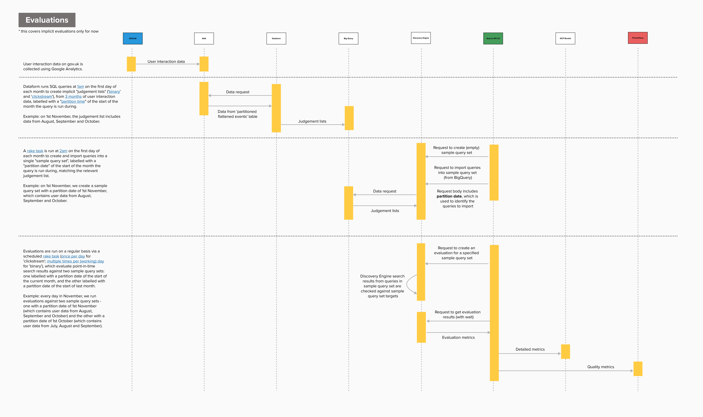

# Evaluations

We use Discovery Engine's in-built evaluations feature to measure the quality and relevance of search results. This allows us to:

- [Monitor search quality](#How-evaluations-are-monitored) with automated alerts if relevance scores drop unexpectedly.

- Compare versions of the Discovery Engine search engine so that we can test out new configurations to improve search results.

Evaluations rely on 'judgement lists' (known as ['sample query sets'][sample-query-sets] in Discovery Engine terminology). These are sets of search queries paired with targets and their ratings, which indicate how relevant specific results are for those queries. We use three sets of judgement lists to create evaluations. When evaluations are run, point-in-time search results are compared to the sample query sets to create [scores](#How-evaluations-are-scored), which can be tracked over time.

## A note on terminology

The terms "judgement list" and "sample query set" refer to very similar but slightly different concepts and so can easily be confused. For clarity:

- A **judgement list** is a both a concept and a dataset that exists in BigQuery. It refers to the curated list of search queries paired with their expected target documents and a relevance score (0–3).

- A **sample query set** is a Discovery Engine resource. It is the specific technical format required by Discovery Engine. The data from a judgement list is imported into Discovery Engine as a "sample query set" to actually execute the evaluation.

## Judgement lists

### Implicit judgement lists

The implicit judgement lists are generated from the results users click on when using site search. Hence they are "implicitly" defined (compared to "explicitly" defined, like the [explicit judgement lists](#explicit)). 

#### Clickstream

The clickstream judgement lists are generated from the results users click on when using site search, with results given a score of 0-3 depending on how many clicks they get. Each query can have multiple targets, the number of which varies depending on how many results have been clicked above the threshold. For example:

```
{
  "queryEntry": {
    "query": "share code",
    "targets": [{
      "uri": "ebf341bc-aa8f-4105-a042-b7ba1b7a110e",
      "score": "3"
    }, {
      "uri": "ce7d39a8-4ae3-4621-b38d-153767270013",
      "score": "2"
    }, {
      "uri": "6f3be85d-4ac0-4f9a-8e78-13ef23081842",
      "score": "2"
    }, {
      "uri": "4b0906d6-8fe8-48c0-ac72-b1ee98cb5e01",
      "score": "2"
    }, {
      "uri": "1f01f4f5-d9c1-416c-8dc8-c459451c7451",
      "score": "1"
    }, {
      "uri": "88e4e053-8345-4015-b747-5e74941553ec",
      "score": "1"
    }, {
      "uri": "abb4ed81-45df-43d6-8f40-045012d23776",
      "score": "1"
    }, {
      "uri": "435fb04f-2b9f-4f44-8b41-2a962e8c46a8",
      "score": "1"
    }, {
      "uri": "63fe19b5-bbcd-4712-9250-a1cd3125c470",
      "score": "1"
    }, {
      "uri": "585fc781-dc17-4a1d-a66c-9515f9970ab5",
      "score": "1"
    }, {
      "uri": "4816fa06-9e6c-4414-96b6-aa7ec7f24968",
      "score": "1"
    }, {
      "uri": "bee455d5-5a4f-440a-88be-eb65ae8fde7d",
      "score": "1"
    }, {
      "uri": "acadabdc-c1ae-42e8-a666-1728f91f4d21",
      "score": "1"
    }, {
      "uri": "2ba2fbbf-c8fd-4e5f-b010-3fe0c1515566",
      "score": "1"
    }]
  }
}
```

This type of judgement list is used for assessing relevance of search results at scale.

#### Binary

The binary judgement lists contain a list of search queries with results that have a score of 3, indicating that they’re a perfect match for the query. The judgement lists are made up of individual query-target pairs. A query can appear more than once in a judgement list if it has multiple targets with a score of 3, but these will be split out into separate query-target pairs, rather than having two targets nested under one query as it would be in a clickstream judgement list. For example:

```
"{
  ""queryEntry"": {
    ""query"": ""check share code"",
    ""targets"": [{
      ""uri"": ""4b0906d6-8fe8-48c0-ac72-b1ee98cb5e01"",
      ""score"": ""3""
    }]
  }
}"
"{
  ""queryEntry"": {
    ""query"": ""check share code"",
    ""targets"": [{
      ""uri"": ""ce7d39a8-4ae3-4621-b38d-153767270013"",
      ""score"": ""3""
    }]
  }
}"
```

This type of judgement list is used for assessing whether any results that should appear are missing - identifying relevance issues quickly.

### Explicit

Manually created and curated judgement lists. The explicit judgements are based on what the search team has determined should be in the top result for a query.

## How evaluations are run

### End-to-end

This diagram shows the end-to-end process of how an evaluation is run, including how the data is prepared before the evaluation and how results are processed afterwards:


This diagram is a screenshot from a live [Mural board][evaluations-sequence-mural-board].

The overall process involves:

1. Gathering user interaction data on gov.uk. This is done using GA4.
2. For binary and clickstream, judgement lists are compiled using user interaction data and stored in Big Query. This is done in SQL via [Dataform][dataform]. The explicit judgement lists are compiled manually.
3. Judgement lists are taken from BigQuery and imported into Discovery Engine as sample query sets. This is done via the [`setup_sample_query_sets` rake task][setup-sample-query-sets-rake-task].
4. Evaluations are run on a regular basis, and results are stored in a GCP Bucket (detailed metrics) and Prometheus (high level metrics). This is done via the [`report_quality_metrics` rake task][report-quality-metrics-rake-task].

Step 4 is usually what we mean when we say 'run an evaluation'.

### Schedule

When first created, the crontasks for running evaluations had the following schedule:

- Every day at 7am GMT (which is 8am BST) we run evaluations of the clickstream, binary and explicit sample query sets.

- Every weekday at 10am, 12pm, 2pm, 4pm GMT (which is 11am, 1pm, 3pm and 5pm BST) we run evaluations of the binary sample query sets.

A gap of two hours was added between each type of evaluation run to stop them from clashing. Only one evaluation can be run at time, and each crontask runs two evaluations, one for [this month and last month](#This-month-and-last-month). Each evaluation takes approximately 20-25 minutes to run on average.

See [`govuk-helm-charts`][govuk-helm-charts] for the current schedule.

## How evaluations are scored

The evaluation process calculates three primary metrics. These are derived by comparing actual search results at the time of the evaluation run, against the sample query sets. The metrics are calculated at specific "top-k" cutoff levels (top 1, top 3, top 5, and top 10) to assess performance at different positions in the search results.

- **Recall** (docRecall): The fraction of relevant targets in the top-k retrieved out of all relevant targets.

- **Precision** (docPrecision): The fraction of retrieved targets in the top-k that are relevant.

- **NDCG** (docNDCG): The Normalised Discounted Cumulative Gain at k. This measures the ranking quality of the search results.

See [GCP Ruby Client docs][interpret-results] for more details.

The full evaluation results that contain metrics for each individual query are known as "detailed metrics". At the end of the evaluation run, the detailed metrics are uploaded to a [GCP Bucket][evaluation-results-bucket]. These can also be [accessed via BigQuery][evaluation-results-in-big-query].

For each evaluation, aggregate metrics are also calculated by averaging the query level results. These are known as ["quality metrics"][quality-metric-definition]. At the end of the evaluation run, quality metrics are pushed to Prometheus.

### Important metrics

For the binary evaluations, we pay particular attention to top-3 Recall. This is an easily interpretable metric that allows us to see whether a particular search result appears in the top 3 results for a given query.

For the clickstream evaluations, we pay particular attention to top-10 NDCG. While this can be more challenging to interpret, it allows us to monitor the ranking quality of the first page of search results.

### This month and last month

As part of our evaluations methodology, we have chosen to create new sample query sets at the start of month, and keep them static for the duration of that month. This is so we have an apples-to-apples comparison of our evaluation results over a given month. However, at the start of a new month, we often see a jump in our evaluation metrics because we are comparing search results against different sample query sets. To help us identify whether this jump indicates an underlying change in results quality, or is just because of the change in the sample query sets, we run evaluations for this month and last month to give us continuity across month changes. For example, an evaluation run on 30 November against a 1 November ("this month") sample query set can be compared to an evaluation run on 1 December against a 1 November (now "last month") sample query set more easily than it could be compared to an evaulation run on 1 December against a 1 December ("this month") sample query set.

## How evaluations are monitored

Evaluations are monitored using Sentry, Kibana, Grafana and Prometheus/Alertmanager. For more information see [GOV.UK Site search alerts and monitoring manual][site-search-alerts-and-monitoring-manual].

[govuk-helm-charts]: https://github.com/alphagov/govuk-helm-charts/blob/main/charts/app-config/values-production.yaml#L3093-L3105
[sample-query-sets]: https://docs.cloud.google.com/ruby/docs/reference/google-cloud-discovery_engine-v1beta/latest/Google-Cloud-DiscoveryEngine-V1beta-SampleQuerySet
[evaluations-sequence-mural-board]: https://app.mural.co/t/govukdelivery7534/m/govukdelivery7534/1760104517917/d4a980e06e67cdc94dd224b2fbbea53804459869
[dataform]: https://github.com/alphagov/search-api-v2-dataform
[setup-sample-query-sets-rake-task]: https://github.com/alphagov/search-api-v2-beta-features/blob/main/lib/tasks/quality.rake#L6
[report-quality-metrics-rake-task]: https://github.com/alphagov/search-api-v2-beta-features/blob/main/lib/tasks/quality.rake#L27
[site-search-alerts-and-monitoring-manual]: https://docs.publishing.service.gov.uk/manual/search-alerts-and-monitoring.html
[evaluation-results-bucket]: https://console.cloud.google.com/storage/browser/search-api-v2-production_vais_evaluation_output;tab=objects?project=search-api-v2-production&prefix=&forceOnObjectsSortingFiltering=false
[evaluation-results-in-big-query]: https://console.cloud.google.com/bigquery?project=search-api-v2-production&ws=!1m5!1m4!4m3!1ssearch-api-v2-production!2svais_evaluation_output!3sresults
[quality-metric-definition]: https://docs.cloud.google.com/ruby/docs/reference/google-cloud-discovery_engine-v1beta/latest/Google-Cloud-DiscoveryEngine-V1beta-Evaluation#Google__Cloud__DiscoveryEngine__V1beta__Evaluation_quality_metrics_instance_
[interpret-results]: https://docs.cloud.google.com/generative-ai-app-builder/docs/evaluate-search-quality#interpret-results
